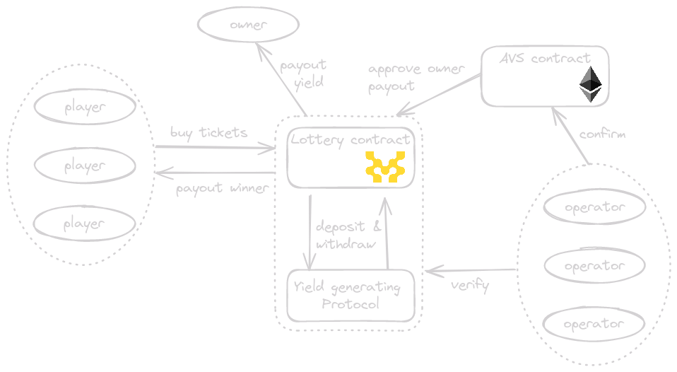

  <h1 align="center">🎰 WinWin Lottery on Movement</h1>
  <a href="TODO">Website</a> |
  <a href="https://github.com/arjanjohan/move-lottery">Repo</a>
</h4>
  

🎰 WinWin Lottery on Movement is the first and only on-chain lottery with 100% (or more) Return To Player (RTP). The pooled money in the lottery contract is put to work up until the lottery closes and determines the winner. The full lottery pool is earning yield according to pre-defined rules that all parties (players and organizers) have agreed upon. To safeguard the integrity of the lottery, an Eigenlayer AVS is ensuring that the yield is earned in a fair manner and the prize pool is not at risk.

⚙️ Built using Eigenlayer, Move, React and Typescript.

<!-- - ✅ **Contract Hot Reload**: The frontend auto-adapts to your smart contract as you edit it.
- 🪝 **[Scaffold hooks](https://docs.scaffoldeth.io/hooks/)**: Collection of React hooks wrapper around [wagmi](https://wagmi.sh/) to simplify interactions with smart contracts with typescript autocompletion.
- 🧱 [**Components**](https://docs.scaffoldeth.io/components/): Collection of common web3 components to quickly build your frontend.
- 🔐 **Integration with Wallet Providers**: Connect to different wallet providers and interact with the AVS smart contracts. -->
## Diagram

<!-- ## Screenshots

| Empty dashboard                   | Live dasboard                     |
| --------------------------------- | --------------------------------- |
|  |  |

|  dashboard                   | dasboard                     |
| --------------------------------- | --------------------------------- |
|  |  | -->

## Contracts

### Lottery
The Lottery contract is the core of our dApp. After each sale, there is an x% chance of closing the lottery. This makes the WinWin lottery twice as exciting, because you don't know when the winner will be decided. When the lottery closes, one player is chosen randomly and he receives 100% of the prizepool. During the duration of the lottery, the pool is used to earn yield. Upon closing, the lottery owner/organizer receives this yield.

#### BuyTickets
Swap tokens for lottery tickets. Each time this function is called, there is a x% chance the lottery will close.

#### SetYieldStrategy
Can only be called by the owner, and it sets up the yield generating strategy. It takes a single contract address as input, and deposits all tokens to this contract. 

### Yield
The Yield contract serves as an example for the happy flow scenario. It's a very simple (and lucrative) yield generating contract, where each deposit earns 1% each blocks. After deploying the contract, it needs to be funded by the deployer so it can pay the yield. Obviously it's only for testing purposes, to showcase how the lottery works.

#### Deposit
Lets any user deposit tokens into the contract. The blocknumber and amount is recorded in the contract.

#### Withdraw
Withdraws all tokens for this user. The total amount is the sum of all deposits and the yield that was generated between the deposit and withdrawal.

## Next steps
- Connect NextJS with M1 Movement
- Create page to interact with lottery
  - Buy tickets
  - Display user tickets
  - Display results (for user)
  - Display totals (amount + time + maybe addresses playing)
- Connext Lottery with Yield contract
- Create AVS 

- Continue building a scaffold-eth like repo for Move to use with Movement Labs.
  - Create deploy script that copies the account address to nextJS after deployment

## Links

- [Vercel](TODO)
- [Github](https://github.com/arjanjohan/move-lottery)
- [Deployed Lottery contract](TODO)
- [Deployed Yield contract](https://explorer.devnet.m1.movementlabs.xyz/account/0xdf921eb55ba53511bfe3c15823a66ab050bb97bf66b219d8c3f68111e2debf12/modules/code/YieldGeneratingProtocol?network=devnet)

## Team

- [arjanjohan](https://x.com/arjanjohan/)
