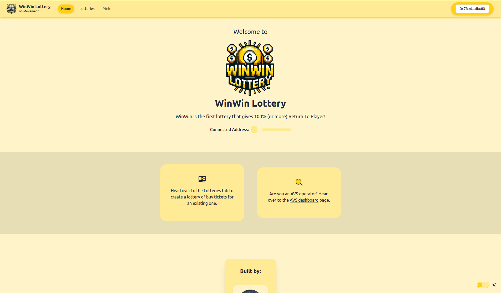
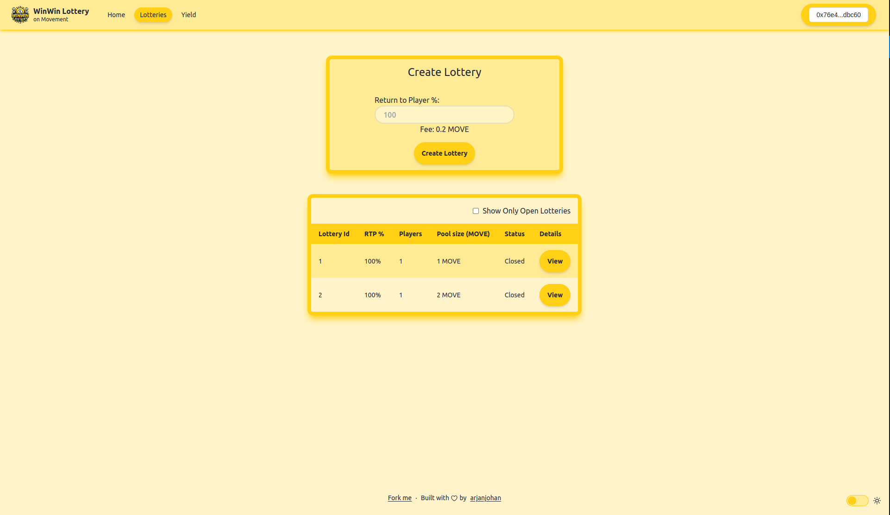
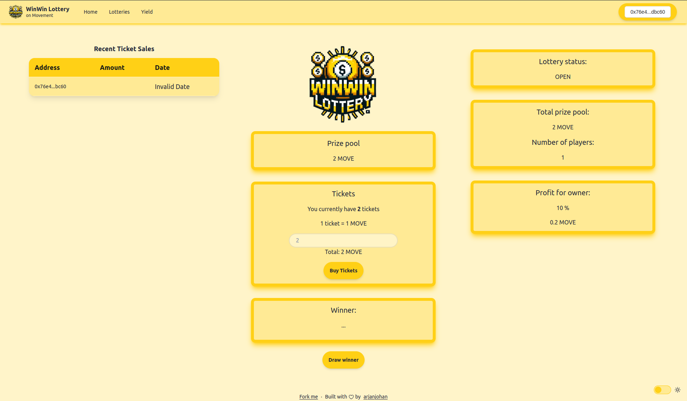

  <h1 align="center">🎰 WinWin Lottery on Movement</h1>
  <a href="https://winwin-lottery.vercel.app/">Website</a> |
  <a href="https://github.com/arjanjohan/move-lottery">Repo</a>
  

🎰 WinWin Lottery on Movement is the first and only on-chain lottery with 100% (or more) Return To Player (RTP). The pooled money in the lottery contract is put to work, until the lottery closes and the winner randomly selected. The  lottery pool is earning yield according to pre-defined rules that all parties (players and organizers) have agreed upon. The winning player(s) receive 100% of the total pool, and the creator/organizer gets the yield that was earned. To safeguard the integrity of the lottery, an Eigenlayer AVS is ensuring that the yield is earned in a fair manner and the prize pool is never at risk.

⚙️ Built using Move, Eigenlayer, Movement, React and Typescript.

🧱 I build this project using [Scaffold-ETH 2](https://scaffoldeth.io/), modifying it to work with Move contracts instead of Solidity/EVM. I did this because the Move starter kit repos that I found did not have a pretty and clean frontend. After the hackathon, I want to continue working on this. Having an easy and intuitive scaffolding tool/repo will be a great tool for all Movement developers.

## Diagram

## Screenshots

| Landing page                      | Create and Overview               |
| --------------------------------- | --------------------------------- |
|  |  |

|  Lottery                          | AVS Dashboard                     |
| --------------------------------- | --------------------------------- |
|  |  |

## Contracts

### Lottery
The Lottery contract is the core of our dApp. After each ticket sale, the proceeds are send to a yield earning protocol, where the money earns interest for the organizer. When the lottery closes, the money is withdrawn from the yield earning protocol. Then,one player is chosen randomly and he receives 100% of the original prize pool. Any profits made on the yield earning protocol are for the organizer.

#### create_lottery
Creates a new lottery in exchange for a small fee. Takes in a u64 value between 100 and 200, which is the RTP (Return To Player) percentage. 

#### place_bet
Swap MOVE tokens for lottery tickets at a 1:1 rate. It takes the amount and lottery_id as inputs. The amount paid for the ticket is automatically transferred to the yield contract.

#### draw_winner
Closes the lottery and randomly determines the winner. Takes a lottery_id as input. After selecting the winner, the lottery pool money is withdrawn from the yield contract and transferred to the player.

### Yield
The Yield contract serves as an example for the happy flow scenario. It's a very simple (and lucrative) yield generating contract, where each deposit earns 10% upon withdrawal. After deploying the contract, it needs to be funded by the deployer so it can pay the yield. Obviously it's only for testing purposes, to showcase how the lottery works.

#### deposit
Lets any user deposit tokens into the contract. The address and amount is recorded in the contract.

#### withdraw
Withdraws all tokens for this user. The total amount is the sum of all deposits and the yield that was generated between the deposit and withdrawal. For testing purposes the yield is fixed at 10% upon withdrawal.

## LotteryServiceManager
This is the AVS contract for the WinWin Lottery. It is used to verify if the lottery contract/owner is using the pool money to earn yield according to the rules set when creating the contract. It verifies the used yield protocol (MOVE address) against a list of approved yield protocols.

#### createNewTask
Creates a new task on the contract which contains all lottery information, including an array of approved yield protocols (MOVE addresses). Emits a NewTaskCreated event.

#### respondToTask
Callable by operators registered to this AVS. Takes in a task and a signature containing the address of the yield protocol used by the lottery. The smart contract verifies if the address of the yield protocol exists in the array of approved yield protocol addresses.

## Next steps

#### Lottery
- Include Aptos randomness module (code is there, but not working on Movement M1 devnet)
- Display recent ticket sales (cannot read events, no indexer on Movement M1 devnet)
- Automate the closing of the lottery
  - Based on time, amount or randomness? Have this as option for creator/owner

#### Scaffold-Move
 During the hackathon I used Scaffold-ETH 2 as the base for the frontend, replacing all EVM components by Move equivalents. After the hackathon I want to continue building a scaffold-eth like repo for Move, to use with Movement Labs.
- Create deploy script that copies the account address to nextJS after deployment
- Create a Debug page
  - Display all deployed Move contracts
  - Interact with all read and write functions
- Add faucet button
- Add block explorer for local networks

## Links

#### Presentation
- [Presentation slides](https://docs.google.com/presentation/d/1OYDtBUJdDUf8DOLzdxWaw5Tu8mV8_wMIrQSRr73XafI/edit?usp=sharing)
- [Presentation video](https://www.loom.com/share/ba038643f748406c96bf1960cfc14f4e?sid=d0902396-0f2d-48b2-8d83-7519b565a6cb)

#### Vercel
- [Lottery dApp](https://winwin-lottery.vercel.app/)
- [AVS dashboard](https://winwin-avs.vercel.app/)

#### Github repos
- [Github: Lottery dApp and Move contracts](https://github.com/arjanjohan/move-lottery)
- [Github: Lottery AVS](https://github.com/arjanjohan/avs-lottery)

#### Contracts

- [Deployed Lottery contract on Movement M1](https://explorer.devnet.m1.movementlabs.xyz/account/0x40311704088e14867deda2e4cb49a2606e4fc21df6d7a51226a91ddbd0ba4e78?network=devnet)
- [Deployed Yield contract on Movement M1](https://explorer.devnet.m1.movementlabs.xyz/account/0x07261beac6e023ed2ba91de8e784c4ae66ef008e62c6ffd989410a7d344fa776?network=devnet)
- [Deployed Lottery AVS on Ethereum Holesky](https://holesky.etherscan.io/address/0x1081ded255574EC1dF6948DfEc3442c54B1De19A)

## Team

- [arjanjohan](https://x.com/arjanjohan/)
